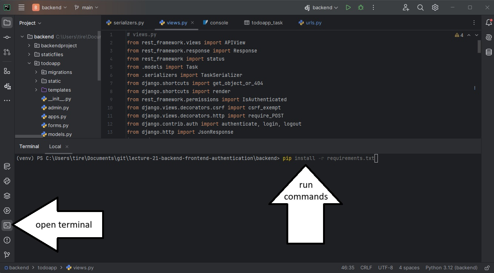

# MLPTTRPG Character creator & manager

## Prerequisites

* Ensure Python is installed: https://www.python.org/downloads/
* Ensure Pycharm is installed: https://www.jetbrains.com/pycharm/download/?section=windows
* Ensure Git is installed: https://git-scm.com/downloads

If you needed to install Python or Git, you'll need to restart your computer before continuing.

## Steps to get this django application running on your own PC

Note that the lab computers may have vim as a default editor for commits. Vim can be scary. I recommend using nano.

**TL;DR: run this command before doing anything else:** `git config --global core.editor "nano"`

1) Open a terminal and navigate to the folder you want to create your project in (e.g. `cd ~Documents/Code`)
2) Clone this repository with `git clone https://github.com/Carleton-BIT/project-MissVampire`
3) Open the repository with PyCharm. You can do this by going file->open and selecting the cloned folder called
   `project-MissVampire`
4) Open a terminal using PyCharm and install dependencies using `pip install -r requirements.txt`
   
5) Create a file called `.env` in the top level directory (should be in the same folder as manage.py)
6) Generate a secret key by running
   `python -c 'from django.core.management.utils import get_random_secret_key; print(get_random_secret_key())'` in the
   terminal. Copy the output.
7) Edit `.env` (created in part 5) and add a line that says `SECRET_KEY="your-secret-key-here"`. Paste the output from
   part 6 into 'your-secret-key-here'.
8) On the terminal, run `python manage.py migrate`
9) Import the core rulebook influences, perks, hangups and bonds by running `python manage.py loaddata core_rulebook.json`
10) Run the server by clicking the play button or running `python manage.py runserver` on the terminal
11) Navigate to 127.0.0.1:8000! You should get the homepage :)
12) To create an admin account, run `python manage.py createsuperuser` 
Go to 127.0.0.1:8000/admin to manage accounts, characters, influences, perks, and hang-ups